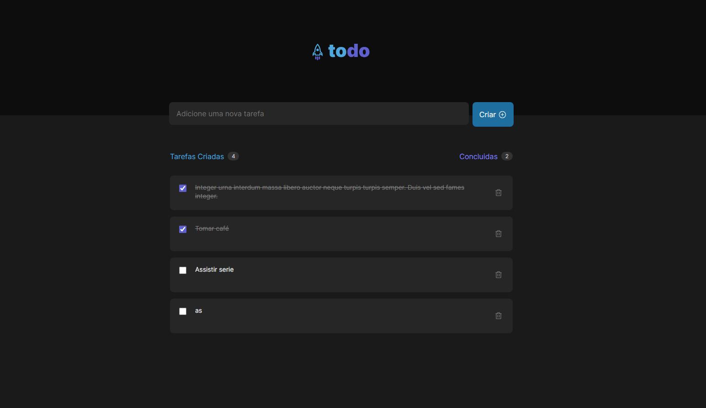

<h1> To-do List 📋</h1>

> To-do List app

A To-do List app with localstorage manage and some counting features.

## Tecnologias

- Typescript
- React
- Css Modules

## Como testar

- Baixe o projeto pelo code do github.
- Abra no terminal e de um npm install.
- Após baixar as dependencias rode com npm run dev.
